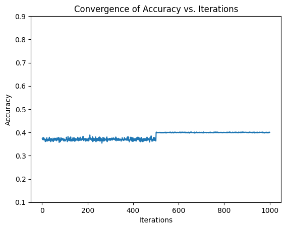

# Letter Recognition Dataset

This project uses the Letter Recognition dataset from the UCI Machine Learning Repository to train an SVM classifier and evaluate its performance using cross-validation. The goal is to predict which of the 26 capital letters of the English alphabet each input image corresponds to, based on a set of 16 numerical attributes extracted from the images.

## Dataset Description

The Letter Recognition dataset contains a total of 20,000 samples, each representing a 20x20 bitmap of a capital letter, along with its corresponding label. The samples have been preprocessed to extract 16 numerical attributes that capture the shape and orientation of the letter in the bitmap. These attributes include the mean and standard deviation of the x and y coordinates, the mean and standard deviation of the distance to the center of mass, the mean and standard deviation of the angles between adjacent points, and so on.

The dataset is available for download from the UCI Machine Learning Repository [here](https://archive.ics.uci.edu/ml/datasets/letter+recognition). The dataset is provided in a single CSV file, where each row corresponds to a sample and each column corresponds to an attribute or label. The first column contains the letter labels (A to Z), and the remaining 16 columns contain the numerical attributes.

## Problem Description

The goal of this project is to train an SVM classifier on the Letter Recognition dataset and evaluate its performance using cross-validation. Specifically, we will divide the dataset into 70% training data and 30% testing data, and train an SVM classifier on the training data using 10-fold cross-validation to optimize hyperparameters. We will then evaluate the performance of the classifier on the testing data using accuracy as the evaluation metric.

## Results

We trained an SVM classifier on the Letter Recognition dataset using the scikit-learn library in Python. The classifier was trained using 10-fold cross-validation and optimized using a grid search over a range of hyperparameters. The best hyperparameters were found to be C=100, kernel='rbf', and degree=2, with an accuracy of 39.98%.

| Sample | Accuracy | C   | Kernel | Nu   |
|--------|----------|-----|--------|------|
| 1      | 39.46    | 1   | rbf    | 0.9  |
| 2      | 38.5     | 100 | linear | 0.5  |
| 3      | 39.59    | 0.1 | linear | 0.5  |
| 4      | 37.69    | 10  | poly   | 0.9  |
| 5      | 35.21    | 100 | rbf    | 0.9  |
| 6      | 39.98    | 0.1 | rbf    | 0.1  |
| 7      | 38.46    | 1   | poly   | 0.9  |
| 8      | 38.89    | 100 | linear | 0.9  |
| 9      | 39.10    | 10  | rbf    | 0.01 |
| 10     | 39.54    | 10  | rbf    | 0.9  |

We also plotted a convergence graph for the SVM classifier using the maximum accuracy and 1000 iterations, which can be seen in the file "convergence.png".

For a more detailed analysis of the dataset and code used in this project, please refer to the Jupyter Notebook.
